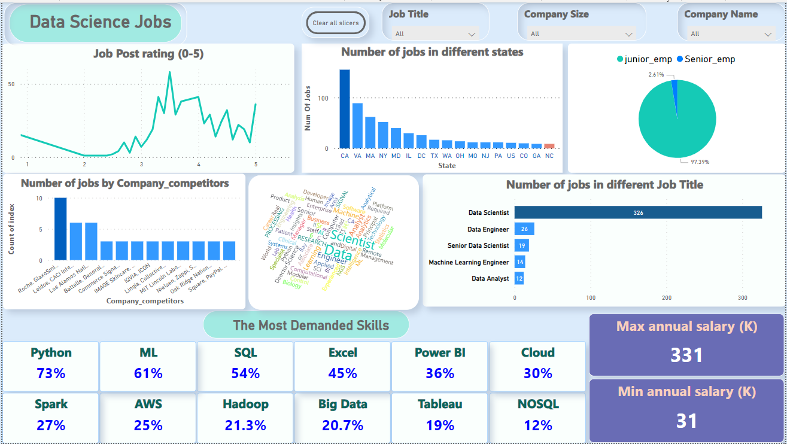

# Data-Analysis-Project
"Data Science Job Posting on Glassdoor" Data Analysis

-----------------------------------------------------------------------------------------------------------------------------------------------------

<h2>Abstract</h2>

The project "Data Science Job Posting on Glassdoor" aims to analyze and provide insights into the landscape of Data Science job opportunities available
on the Glassdoor platform.
By examining a comprehensive dataset of job postings, this project seeks to uncover trends, patterns, and key information relevant to job seekers 
and employers in the Data Science field.
The methodology involves collecting and analyzing data from job postings on Glassdoor, focusing on various aspects such as job titles, required skills, 
experience level, salary information, and other relevant factors. 

-----------------------------------------------------------------------------------------------------------------------------------------------------

<h2>Problem statement</h2>

The problem lies in the lack of comprehensive and easily accessible information regarding Data Science job postings on Glassdoor. Job seekers often spend 
significant time and effort manually searching through numerous job listings, making it challenging to identify the most suitable opportunities.
Employers, on the other hand, struggle to understand the evolving demands of the job market, leading to ineffective recruitment strategies and difficulty 
in finding the right candidates.
To address this problem, the project aims to collect and analyze a large dataset of Data Science job postings on Glassdoor. The goal is to uncover trends,
patterns, and key factors influencing Data Science job postings, including job titles, required skills, experience levels, salary ranges.

-----------------------------------------------------------------------------------------------------------------------------------------------------

<h2>Visualization</h2>
   
  

  -------------------------------------------------------------------------------------------------------------------------------
  

